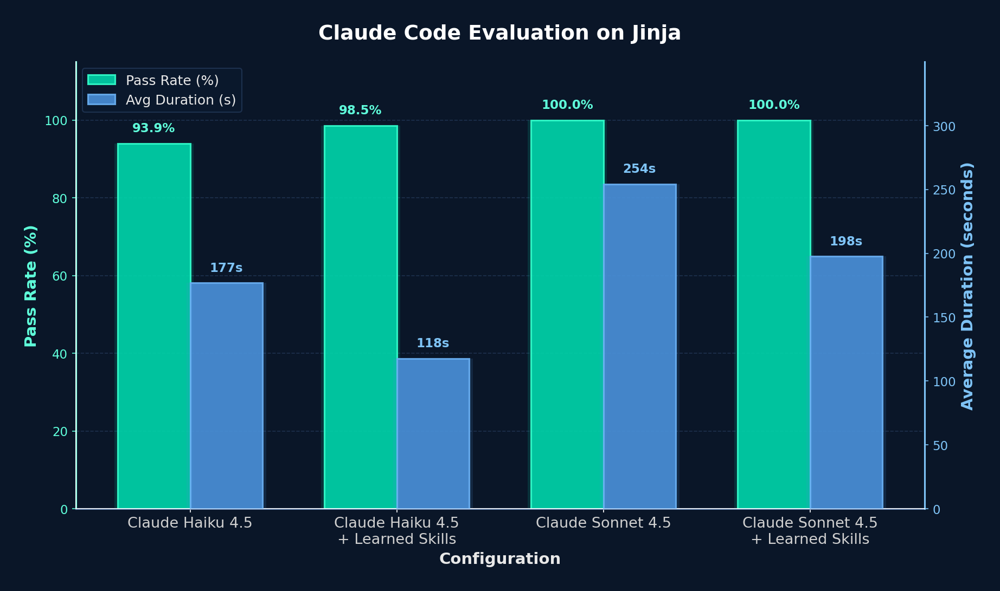

---
date:
  created: 2026-02-18
authors:
  - shangyin
  - lakshya
  - rohit
  - dan
  - koushik
  - alex
  - matei
equal_contribution:
  - "Shangyin Tan"
  - "Lakshya A Agrawal"
slug: automatically-learning-skills-for-coding-agents
title: "Automatically Learning Skills for Coding Agents"
description: "Introducing gskill, a fully automated pipeline that uses GEPA and SWE-smith to learn repository-specific skills for coding agents."
social_image: blog/2026-02-18-automatically-learning-skills-for-coding-agents/bleve_comparison_plot.png
---

# Automatically Learning Skills for Coding Agents

Today, we are introducing **gskill**, a fully automated pipeline to learn skills for any repository. Given any GitHub repository, gskill creates important agent [skill files](https://platform.claude.com/docs/en/agents-and-tools/agent-skills/overview) for coding agents. These skills help the coding agent understand the repository and complete the tasks more efficiently.

Using gskill, we learn repository-specific skills for [jinja](https://github.com/pallets/jinja) and [bleve](https://github.com/blevesearch/bleve) with a simple agent (Mini-SWE-Agent, gpt-5-mini), boosting its resolve rate from **55% to 82%** on Jinja and from **24% to 93%** on Bleve. These skills also transfer directly to Claude Code: on Bleve, Claude Haiku 4.5 jumps from 79.3% to 100% pass rate while running faster; on Jinja, Claude Haiku 4.5 improves from 93.9% to 98.5%. For Claude Sonnet 4.5, although the pass rate saturated, we still observe significant task duration reduction with the learned skills.

<!-- more -->

## The Recipe

gskill consists of two main components:

1. **GEPA's [optimize_anything](https://gepa-ai.github.io/gepa/)** -- a powerful API to optimize any textual artifact, including _skills_.
2. **SWE-smith** -- a data generation pipeline that creates arbitrary verifiable tasks for any GitHub repository, providing meaningful training and validation data for the optimization process.

<figure markdown="span">
  
  <figcaption>The gskill pipeline: SWE-smith generates tasks from a target repository, and the GEPA optimization loop iteratively evolves skills through agent evaluation and reflective proposal. Then, the learned skills can be used by any coding agent.</figcaption>
</figure>

Learning skills requires feedback, and feedback requires tasks. This is where **SWE-smith** comes in. Given a GitHub repository, SWE-smith automatically generates a diverse set of verifiable software engineering tasks. These tasks are grounded in the real codebase and come with verifiable tests. Think of SWE-smith as converting a static repository into an active training environment for the optimization process.

Once we have tasks, we can optimize with `optimize_anything`. We build gskill based on the belief that there are common skills about a repository that can be crucial for most tasks within the repository, and these skills should be learned, automatically. To achieve this goal, `optimize_anything`[^gepa-docs] provides the backbone of the learning loop.

[^gepa-docs]: For readers who are not familiar with how `optimize_anything` and GEPA works, we highly recommend checking out the [official documentation](https://gepa-ai.github.io/gepa/).

In a nutshell, the `optimize_anything` loop starts with a (possibly empty) set of skills, evaluates the agent with a chosen skill, and then updates the skill by employing another more powerful LLM to reflect on the evaluation results and feedback. This process is repeated until convergence.

## Experiments

To evaluate gskill, we chose two popular repositories: [jinja](https://github.com/pallets/jinja) and [bleve](https://github.com/blevesearch/bleve). Our evaluation setup:

- Start with default **mini-swe-agent** powered by gpt-5-mini
- Generate ~300 SWE-smith tasks per repository
- Create train (~200), validation (~50), and test (~60) splits from the tasks
- Use gskill to learn skills for the agent
- Evaluate performance on a holdout test set
- Transfer the **learned skills** to Claude Code and evaluate with both claude-haiku-4-5 and claude-sonnet-4-5

### Start with Mini-SWE-Agent

To start with, we tested a proof-of-concept implementation of gskill on a simple agent [Mini-SWE-Agent](https://github.com/SWE-agent/mini-swe-agent) with a relatively smaller model, gpt-5-mini.

<figure markdown="span">
  
  <figcaption>Mini-SWE-Agent performance with GEPA-evolved skills. Skills learned via gskill dramatically improve resolve rates on both repositories.</figcaption>
</figure>

Under 300 rollouts, the Mini-SWE-Agent with GEPA-evolved skills achieves a resolve rate of 82% on Jinja and 93% on Bleve, compared to the baseline of 55% and 24% respectively. While the results are promising, Mini-SWE-Agent is a relatively simple agent, and we are curious to learn if the learned skills are transferable to a production-ready agent.

### Transfer to Claude Code 

To measure whether the learned skills are beneficial for other agents as well, we perform the experiments on the same set of tasks, but with Claude Code. We installed Claude Code into the task environment, and evaluated the performance with and without the learned skills (as a `.claude/skills/{repo_name}/SKILL.md` file). Here are the results:

<figure markdown="span">
  
  <figcaption>Claude Code evaluation on Bleve. Skills learned on Mini-SWE-Agent (gpt-5-mini) transfer to Claude Code, boosting pass rates while also reducing average task duration. Please note that the Bleve repository is primarily in Go, so this shows our framework can create skills useful in languages beyond Python.</figcaption>
</figure>

<figure markdown="span">
  
  <figcaption>Claude Code evaluation on Jinja. Skills learned on Mini-SWE-Agent (gpt-5-mini) transfer effectively to Claude Code, achieving near-perfect pass rates.</figcaption>
</figure>


## Learned Skills

Here, we showcase some of the learned skills for the Bleve repository.

```text
4) Run tests early and iterate from failures (tests are the bug report)
- Start broad when feasible: `cd /testbed && go test ./...` (or project equivalent).
- Narrow quickly:
  - package: `go test ./path/to/pkg`
  - single test: `go test ./path/to/pkg -run TestName -count=1` (add -v only if needed)
- For panics: follow the stack trace top frame in repo code first.
- For mismatches: use “expected vs got” to locate the producing function and invariants.

...

7) Make minimal, reviewable changes and verify continuously
- Change one behavior at a time; rerun the smallest reproducing test after each change.
- Add focused unit tests when coverage is missing; keep them in the same package and table-driven where sensible (include short words + accented/Unicode edge cases).
- Avoid scratch main.go files in repo root.
```

These skills are especially helpful for the coding agents to navigate and fix issues in the Bleve repository. In fact, the skills are learned through the coding agent's successes and failures on the exact same repository, and our experiments showed that the skills are transferable across language models and agent harnesses.

Note that some of these skills are more helpful for SWE-smith style tasks (fixing issues) instead of general coding practices. We view this as a future direction of gskill, and believe that the more general skills can be learned with a more diverse set of tasks.


## Conclusion

gskill demonstrates the power of evolutionary search for learning skills. With _fully automated_ learning pipeline for skills, downstream agents benefit from the learned skills for free.

A few key takeaways from our experiments:

1. **Massive improvements on weaker baselines.** The most striking gains come when the baseline agent struggles. On Bleve, Mini-SWE-Agent went from a 24% resolve rate to 93% — a nearly 4x improvement. This suggests that learned skills are especially valuable when the model lacks prior familiarity with a repository's conventions and patterns.

2. **Skills transfer across models and agents.** Perhaps the most exciting finding is that skills learned on gpt-5-mini with a simple agent (Mini-SWE-Agent) transfer effectively to Claude Code with both Haiku 4.5 and Sonnet 4.5. This means you can learn skills cheaply on a smaller model and deploy them with a production-grade agent.

3. **Skills reduce cost, not just improve accuracy.** Beyond pass rate improvements, we observe consistent reductions in average task duration when skills are applied. On Bleve with Claude Haiku 4.5, average duration dropped from 173s to 142s while pass rate jumped from 79.3% to 98.3%. Learned skills help agents navigate the repository more efficiently, leading to faster and cheaper completions.


## What's Next

With `optimize_anything`, we are excited to see more applications and expansions of evolutionary search for learning skills.

Several areas we are excited to explore:

1. **Scaling dataset beyond SWE-smith.** SWE-smith is great, but the tasks generated are on the simpler side. We would like to obtain more complex tasks that are more representative of real-world SWE tasks.

2. **Evolve more than a `SKILL.md` file.** Many skills have executable scripts. Generating and evolving may further improve the skills.

3. **Skills for non-SWE tasks.** The gskill pipeline is designed to work with evolving any text (thanks to `optimize_anything`). We are excited to see how skills can be learned for non-SWE tasks (e.g., computer use).