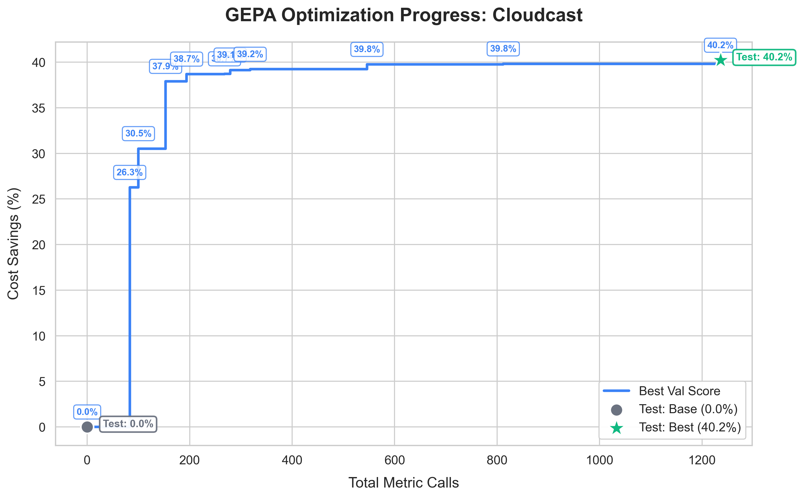
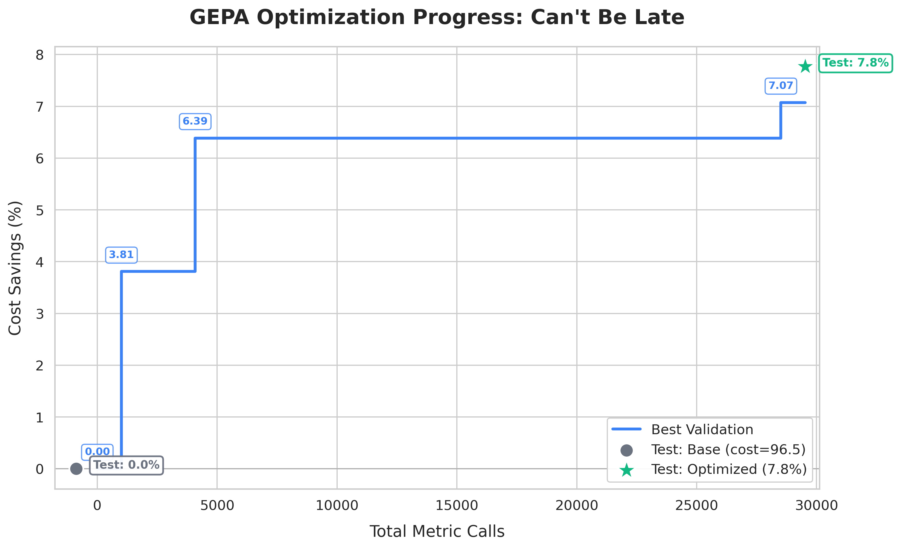
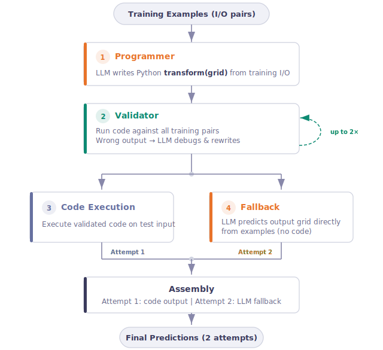
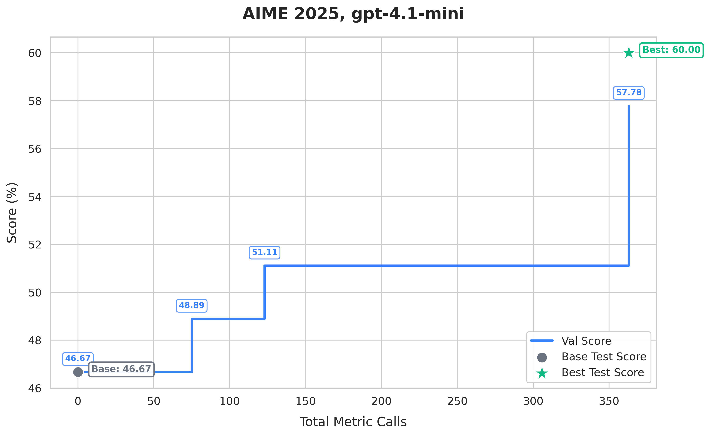
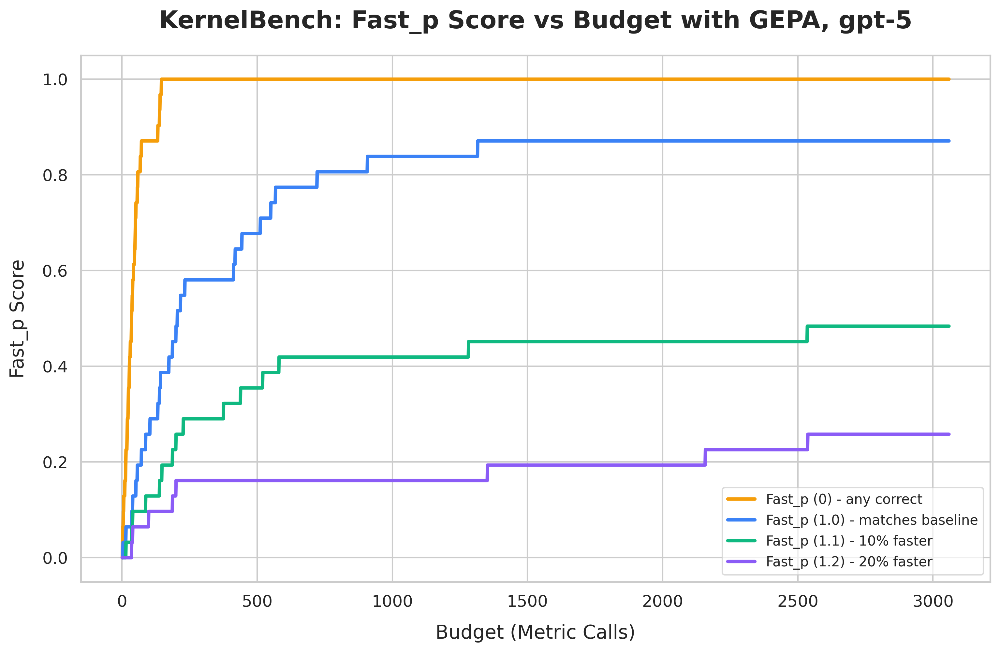
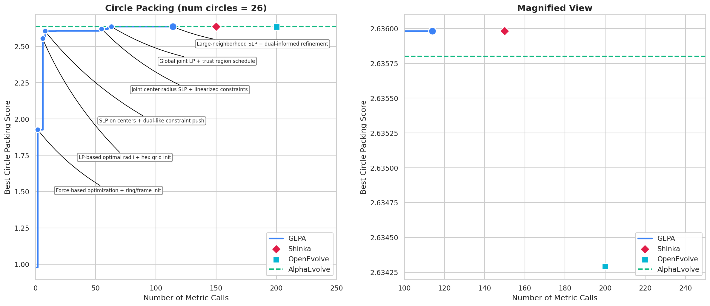
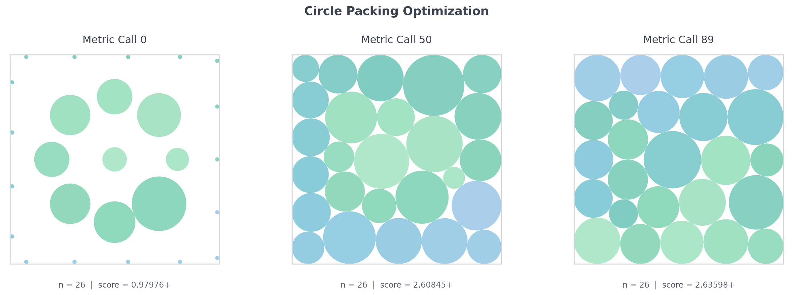
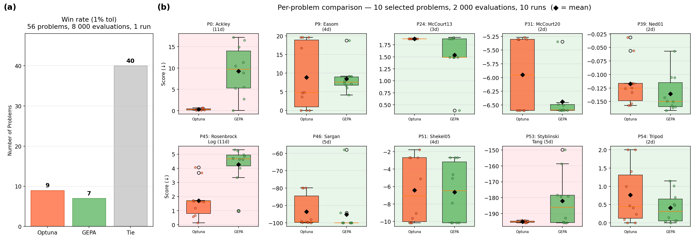

---
date:
  created: 2026-02-18
authors:
  - lakshya
  - donghyun
  - wenjie
  - karim
  - shangyin
  - sanjit
  - koushik
  - dan
  - ion
  - joey
  - omar
  - alex
  - matei
equal_contribution:
  - "Lakshya A Agrawal"
  - "Donghyun Lee"
slug: introducing-optimize-anything
readtime: 12
title: "optimize_anything: A Universal API for Optimizing any Text Parameter"
description: "GEPA's new API setting state-of-the-art results on optimizing any text parameter: code, prompts, agent architectures, and more. If you can measure it, you can optimize it."
social_image: blog/2026-02-18-introducing-optimize-anything/images/header_image.png
---

# <span class="gradient-code">optimize_anything</span>: A Universal API for Optimizing any Text Parameter

Today we are introducing `optimize_anything`, a declarative API that optimizes any artifact representable as text (e.g., code, prompts, agent architectures, vector graphics, configurations). It extends [GEPA](https://arxiv.org/abs/2507.19457) (Genetic-Pareto, our state-of-the-art LLM prompt optimizer) far beyond prompts. You declare what to optimize and how to measure it; the system handles the search. Testing it across [several domains](#results), we find `optimize_anything` consistently matches or outperforms domain-specific tools, including some purpose-built for each task. With one API, you can:

- [create agent skills achieving near-perfect Claude Code task completion 47% faster](#1-coding-agent-skills),
- [optimize cloud scheduling policies that cut costs by 40%, beating expert heuristics](#2-systems-research),
- [find detailed system prompts to boost GPT's math reasoning accuracy](#4-prompt-optimization),
- [discover bespoke agent harnesses that nearly triple Gemini Flash's ARC-AGI accuracy](#3-agent-architecture-discovery),
- [write custom solvers to match and exceed Optuna in blackbox mathematical optimization](#7-blackbox-optimization),
- and... [model a 3D unicorn](#8-3d-unicorn).

<div style="display: flex; align-items: center; justify-content: center; gap: 1rem;" markdown>
<div style="flex: 1; text-align: center; min-width: 0;" markdown>

{ style="width: 100%;" }

<div style="margin: 0.5rem 0 0; max-width: none; width: 100%;"><em>Zero-shot attempt from Claude Opus 4.6</em></div>

</div>
<div style="flex: 1; text-align: center; min-width: 0;" markdown>

{ style="width: 100%;" }

<div style="margin: 0.5rem 0 0; max-width: none; width: 100%;"><em>Optimized by <span class="gradient-code">optimize_anything</span></em></div>

</div>
</div>

The key insight is that a surprisingly wide range of problems can be formulated as optimizing a text artifact: speeding up a CUDA kernel, tuning a scheduling policy, refining a prompt template, or redesigning an agent architecture. If it can be serialized to a string and its quality measured, an LLM can reason about it and propose improvements.

Where prior LLM-evolution frameworks like AlphaEvolve, OpenEvolve, and ShinkaEvolve expose concepts like island topologies[^islands], prompt samplers[^samplers], and cascade evaluation stages[^cascade], `optimize_anything` strips the interface down to its essence — and goes further by unifying **three optimization modes** (single-task search, multi-task search, and generalization) under one declarative API. While prior systems operate exclusively in single-task mode, `optimize_anything` enables optimization tasks they cannot directly express like [discovering agent architectures from scratch](#3-agent-architecture-discovery), [learning prompts that generalize to unseen examples](#4-prompt-optimization), and [optimizing coding agent skills that transfer across models](#1-coding-agent-skills).

<figure markdown="span">
  
  <figcaption>Evaluate a text artifact, capture diagnostic feedback (ASI), and let an LLM propose targeted improvements. Code, prompts, configs, agent architectures — if you can measure it, <span class="gradient-code">optimize_anything</span> can optimize it.</figcaption>
</figure>

## The <span class="gradient-code">optimize_anything</span> API

### The Simplest Form

At its core, the API requires just two things: an artifact (or a description of what you want) and an evaluator.

```python
import gepa.optimize_anything as oa

def evaluate(candidate: str) -> float:
    score, diagnostic = run_my_system(candidate)
    oa.log(f"Error: {diagnostic}")  # captured as ASI
    return score

# Start from an existing artifact…
result = oa.optimize_anything(
    seed_candidate="<your initial artifact>",
    evaluator=evaluate,
)

# … or just describe what you need.
result = oa.optimize_anything(
    evaluator=evaluate,
    objective="Generate a Python function `reverse()` that reverses a string.",
)

print(result.best_candidate)
```

That's it. The evaluator takes a candidate string and returns a score (higher is better). `oa.log()` works just like `print()`, but routes output to the LLM proposer as **Actionable Side Information (ASI)** — diagnostic feedback the proposer reads during reflection. For richer diagnostics, return a structured dictionary alongside the score:

```python
def evaluate(candidate: str) -> tuple[float, dict]:
    result = execute_code(candidate)
    return result.score, {
        "Error": result.stderr,
        "Output": result.stdout,
        "Runtime": f"{result.time_ms:.1f}ms",
    }
```

ASI can be open-ended text, structured data, multi-objectives (through `scores`), or even **images** (via `gepa.Image`) for vision-capable LLMs; anything that would help an expert understand the artifact and diagnose failures. We'll see ASI in action in the [SVG demo](#lets-take-it-for-a-spin), then unpack [why it matters](#the-key-ingredients).

### One Interface, Three Optimization Modes

<figure markdown="span">
  
  <figcaption>The three optimization modes supported in <span class="gradient-code">optimize_anything</span>: single-task search, multi-task search, and generalization.</figcaption>
</figure>

`optimize_anything` unifies three distinct optimization paradigms under one API, determined by whether you provide a `dataset` and `valset`:

**1. Single-Task Search**: "Solve one hard problem." No dataset needed; the candidate *is* the solution, and the evaluator scores it directly (no `example` argument). For example, in [circle packing](#6-circle-packing), the artifact is the packing algorithm code and the evaluator returns the score plus geometric diagnostics as ASI. This is the mode that prior LLM-evolution frameworks like [AlphaEvolve](https://deepmind.google/discover/blog/alphaevolve-a-gemini-powered-coding-agent-for-designing-advanced-algorithms/) and [OpenEvolve](https://github.com/codelion/openevolve) operate in.

```python
oa.optimize_anything(seed_candidate=..., evaluator=...)
```

**2. Multi-Task Search**: "Solve a batch of related problems with cross-transfer." You provide a `dataset` of related tasks; insights from solving one help solve the others. For example, in [CUDA kernel generation](#5-cuda-kernel-generation), each task is a PyTorch operation to accelerate on the same hardware, and the evaluator compiles and benchmarks the kernel returning compiler errors and profiler traces as ASI. Even though the kernels perform different computations, multi-task mode converges faster and solves more problems across all speedup thresholds than dedicated single-task optimization, thanks to cross-transfer of optimization patterns. No prior LLM-evolution framework supports this mode.

```python
oa.optimize_anything(seed_candidate=..., evaluator=..., dataset=tasks)
```

**3. Generalization**: "Build a skill that transfers to unseen problems." You provide both a training `dataset` and a held-out `valset`; the optimized artifact (a prompt, an agent, a policy) must generalize to unseen examples. This is the mode that GEPA's prompt optimization operates in. `optimize_anything` generalizes the pattern to any text artifact, not just prompts, abstracting over traditional machine learning and program synthesis. For example, in [agent architecture discovery](#3-agent-architecture-discovery), the artifact is the entire agent, the dataset and valset are ARC-AGI puzzles, and the evaluator runs the agent and returns its errors as ASI. The optimized agent improves from 32.5% to 89.5% on the test set (+57 percentage points). The same mode also powers [cloud scheduling policy discovery](#2-systems-research), where the artifact is an algorithm that must generalize across unseen infrastructure scenarios.

```python
oa.optimize_anything(seed_candidate=..., evaluator=..., dataset=train, valset=val)
```

The full API signature:

```python
def optimize_anything(
    seed_candidate: str | dict[str, str] | None = None,  # Starting artifact (or None for seedless)
    evaluator: Callable,                    # Score + ASI
    dataset: list | None = None,            # Training examples (modes 2 & 3)
    valset: list | None = None,             # Validation set (mode 3)
    objective: str | None = None,           # What to optimize for (natural language)
    background: str | None = None,          # Domain knowledge and constraints
    config: GEPAConfig | None = None,       # Engine, reflection, tracking settings
) -> GEPAResult:
    """
    Call with either (seed_candidate+evaluator) or (evaluator+objective)
    """
```

Notice what's *absent*: no mutation prompts, no task-specific instruction templates, no island configurations, no EVOLVE-BLOCK markers (all common in prior LLM-evolution frameworks). You declare the **what** (your artifact, your evaluator, and any domain knowledge as `background`) and `optimize_anything` handles the **how**: prompt construction, reflection, candidate selection, and search strategy. This declarative design, inspired by [DSPy](https://github.com/stanfordnlp/dspy)'s principle of *programming not prompting*, means the same API call works whether you're optimizing a CUDA kernel, a cloud scheduling policy, or an agent architecture.

## Let's Take It for a Spin

Let's use `optimize_anything` to optimize SVG source code depicting "a pelican riding a bicycle" starting from a blank white canvas. The evaluator renders the SVG as a PNG, asks a VLM to score it against visual criteria, and passes the rendered image back as ASI so the proposer can literally *see* what it's improving. Here's the zero-shot baseline from Claude Opus 4.6 versus the best optimized result after exploring 20 candidates:

<div style="display: flex; align-items: center; justify-content: center; gap: 1rem;" markdown>
<div style="flex: 1; text-align: center; min-width: 0;" markdown>

{ style="width: 100%;" }

<div style="margin: 0.5rem 0 0; max-width: none; width: 100%;"><em>Zero-shot attempt from Claude Opus 4.6</em></div>

</div>
<div style="flex: 1; text-align: center; min-width: 0;" markdown>

{ style="width: 100%;" }

<div style="margin: 0.5rem 0 0; max-width: none; width: 100%;"><em>Best candidate (score: 0.817)</em></div>

</div>
</div>

The optimizer added background elements, improved anatomy, increased the sophistication of all visual elements, and refined the composition — all through LLM reflection on rendered image feedback.

Notably, we optimize the SVG code itself, not a prompt that generates SVG. Here's the code.

First, we define our evaluator and the visual aspects we'd like it to grade for:

```python title="Defining the evaluator"
from gepa import Image
from demo_utils import render_image, get_vlm_score_feedback

GOAL = "a pelican riding a bicycle"
VLM = "vertex_ai/gemini-3-flash-preview"

def evaluate(candidate, example):
    """Render SVG → image, score with a VLM, return (score, side_info)."""
    image = render_image(candidate["svg_code"]) # via cairosvg
    score, feedback = get_vlm_score_feedback(VLM, image, example["criteria"]) # simple regex parser

    return score, {
        "RenderedSVG": Image(base64_data=image, media_type="image/png"),
        "Feedback": feedback,
    }

VISUAL_ASPECTS = [
    # 6 visual aspects → Pareto-efficient selection
    {"id": "overall",     "criteria": f"Rate overall quality of this SVG ({GOAL}). SCORE: X/10"},
    {"id": "anatomy",     "criteria": "Rate pelican accuracy: beak, pouch, plumage. SCORE: X/10"},
    {"id": "bicycle",     "criteria": "Rate bicycle: wheels, frame, handlebars, pedals. SCORE: X/10"},
    {"id": "composition", "criteria": "Rate how convincingly the pelican rides the bicycle. SCORE: X/10"},
    {"id": "visual",      "criteria": "Rate visual appeal, scenery, and color usage. SCORE: X/10"},
    {"id": "craft",       "criteria": "Rate SVG technical quality: shapes, layering. SCORE: X/10"},
]
```

Then, we put it all together and run `optimize_anything`:
```python title="Running optimize_anything"
from gepa.optimize_anything import (
    optimize_anything, GEPAConfig, EngineConfig, ReflectionConfig,
)

result = optimize_anything(
    seed_candidate={"svg_code": open("seed.svg").read()}, # a plain white canvas
    evaluator=evaluate,
    dataset=VISUAL_ASPECTS,
    objective=f"Optimize SVG code to illustrate '{GOAL}'. Output ONLY valid SVG.",
    config=GEPAConfig(
        engine=EngineConfig(max_metric_calls=150),
        reflection=ReflectionConfig(reflection_lm=VLM),
    ),
)
print(result.best_candidate)
```

A few things to note:

- The **`dataset`** contains 6 evaluation aspects. GEPA calls the evaluator once per aspect per candidate, tracking scores individually. This enables [Pareto-efficient selection](#pareto-efficient-search): a candidate that excels at bicycle structure but struggles with pelican anatomy is preserved on the frontier, not discarded because its overall average score is smaller.
- Our desired visual aspects are defined in concise natural language. We avoid the need for detailed rubrics and simply rely on the VLM's judgment for scoring.
- **`reflection_minibatch_size=2`** (the default) means each reflection step shows the LLM feedback from just 2 of the 6 aspects. Over multiple iterations, all aspects get attention, but each reflection is focused and targeted.
- The **rendered image** is passed as ASI via `Image(base64_data=...)`, giving the VLM proposer visual feedback on its own output. The VLM evaluator never sees the SVG code, only the rendered image. The proposer sees both the feedback and the source SVG, and proposes targeted improvements.


## How It Works {#the-key-ingredients}

Classical optimization methods reduce all diagnostic context to a single scalar. They know *that* a candidate failed, but not *why*. You can't show a Bayesian optimizer the stack trace that pinpoints the bug. Recent LLM-evolution frameworks changed this by feeding execution results and textual feedback into LLM proposers. However, the "evolutionary" framing these frameworks inherit suggests a blind process — mutate, evaluate, select, repeat. But when an LLM reads a compiler error, diagnoses a logic bug, and proposes a targeted fix, that's not natural selection, it's an engineer iterating on a prototype. `optimize_anything` leans into this with two key ingredients: **diagnostic feedback as a first-class API concept** and **Pareto-efficient search**.

### Actionable Side Information (ASI)

`optimize_anything` makes diagnostic feedback a **first-class part of the evaluator contract**. Prior frameworks expose feedback through framework-specific mechanisms; ASI provides a uniform interface that makes it trivial to surface any diagnostic the evaluator can produce, including modalities no prior framework supports, such as rendered images that let a VLM visually inspect its own output. In the pelican demo, the evaluator passed the rendered SVG back as an image so the proposer could literally *see* what it was improving. During a dedicated reflection step, the proposer reasons over this signal to diagnose failures and propose targeted fixes.

<figure>
  <div style="width:100%; max-width:800px; margin:0 auto; position:relative; padding-bottom:61.25%; height:0; overflow:hidden;">
    <iframe src="../../../../../static/diagrams/side_info_diagram.html" scrolling="no" style="position:absolute; top:0; left:0; width:100%; height:100%; border:none;"></iframe>
  </div>
  <figcaption>ASI is the text-optimization analogue of the gradient. Where gradients tell a numerical optimizer which direction to move, ASI tells an LLM proposer why a candidate failed and how to fix it.</figcaption>
</figure>

### Pareto-Efficient Search

Even when optimizing a single objective, evaluating candidates across multiple aspects or examples produces richer signal. The naive approach collapses that signal into one average score and always improves the top candidate. This stalls fast: averaging hides which aspects are strong and which are weak, and the proposer tries to improve everything at once instead of focusing.

`optimize_anything` does two things differently. First, it tracks scores per task (expressed in `dataset` or `valset`) or metric (expressed in returned score from evaluator and `scores` field in ASI) individually and maintains a **Pareto frontier**: any candidate that is the best at *something* survives, even if its average is suboptimal. Second, each reflection step shows the proposer a minibatch of just 2–3 examples or metrics instead of all of them. The proposer makes focused, targeted improvements on that subset, and the Pareto frontier ensures these specialized gains are preserved across iterations rather than averaged away. Over iterations, the frontier accumulates complementary strengths, and the best candidates combine them. The same mechanism powers multi-task search: when optimizing across a batch of related problems, the frontier preserves candidates that excel on different tasks, and strategies discovered for one problem transfer to others — which is why [multi-task mode outperforms dedicated single-task optimization](#5-cuda-kernel-generation) on CUDA kernel generation.

## Results

`optimize_anything` learns repository-specific skills that push coding agents to near-perfect accuracy, discovers novel cloud scheduling algorithms that cut costs by 40%, evolves a 10-line agent stub into a 300+ line system that nearly triples its test accuracy on ARC-AGI, boosts GPT's math reasoning via prompt optimization, generates fast CUDA kernels, beats AlphaEvolve's solution at circle packing, matches Optuna (a mature numerical optimizer) by generating custom solver code from scratch, and models a 3D unicorn from no seed code. We test across eight domains spanning search, batch optimization, and generalization. Each section below walks through the examples and links to [full, runnable code](#appendix-case-study-code).

### 1. Optimize Agent Skills: Near-Perfect Claude Code Accuracy, 47% Faster {#1-coding-agent-skills}

**Mode: Generalization.** Skills (natural-language instructions and best practices for working with a specific codebase) are text artifacts too. `optimize_anything` can optimize them: the evaluator runs a coding agent on real tasks from the repository and scores whether it resolves them; the optimized skills must generalize to unseen tasks.

<figure markdown="span">
  
  <figcaption>Claude Code on Bleve: optimized skills boost Haiku 4.5 pass rate from 79.3% to 100% and Sonnet 4.5 from 94.8% to 100%, while reducing resolve duration by 47%.</figcaption>
</figure>

The results are striking: GEPA-optimized skills boost resolve rates from 24% to **93%** on one repository and from 55% to **82%** on another, and transfer directly to Claude Code, pushing it to near-perfect pass rates while cutting resolution time by **47%**.

**Key result:** `optimize_anything` learns repository-specific skills that dramatically improve coding agent performance and transfer across models. [Read the full post →](../automatically-learning-skills-for-coding-agents/)

### 2. Discover Cloud Algorithms That Cut Costs up to 40% {#2-systems-research}

**Mode: Generalization.** We optimize cloud infrastructure algorithms: **CloudCast** discovers broadcast routing strategies for multi-cloud data transfer (minimizing egress cost), and **Can't Be Late** learns scheduling policies that decide when to use cheap-but-preemptible SPOT instances versus reliable ON_DEMAND instances to complete tasks before deadlines.

<div style="display: flex; align-items: flex-start; justify-content: center; gap: 1rem;" markdown>
<div style="flex: 1; text-align: center; min-width: 0;" markdown>

{ style="width: 100%;" }

<div style="margin: 0.5rem 0 0;"><em><strong>CloudCast (40.2% cost savings):</strong> Optimizes from baseline Dijkstra routing to a provider-aware Steiner tree algorithm with Pareto-frontier candidate selection.</em></div>

</div>
<div style="flex: 1; text-align: center; min-width: 0;" markdown>

{ style="width: 100%;" }

<div style="margin: 0.5rem 0 0;"><em><strong>Can't Be Late (7.8% cost savings):</strong> Optimizes from a simple deadline-check heuristic to an adaptive scheduling strategy that tracks spot availability patterns and computes break-even switching costs.</em></div>

</div>
</div>

**Key result:** `optimize_anything` discovers state-of-the-art algorithms for both problems (40.2% cost savings on CloudCast and 7.8% cost savings on Can't Be Late), topping the ADRS leaderboard (outperforming OpenEvolve, ShinkaEvolve, and expert-designed heuristics). [CloudCast code →](#appendix-d-cloudcast) | [Can't Be Late code →](#appendix-d2-cant-be-late)

### 3. Nearly Triple Gemini-Flash's ARC-AGI Accuracy via Agent Architecture Evolution {#3-agent-architecture-discovery}

**Mode: Generalization.** This is the most ambitious application. Rather than optimizing a prompt, we optimize the **entire agent system**: code, sub-agent architecture, control flow, helper functions, and prompts are all treated as a single text artifact. The seed is a 10-line naive agent; GEPA evolves it into a 300+ line system with rule induction, code verification, iterative refinement, and structured fallbacks. It nearly triples Gemini Flash's ARC-AGI accuracy at just twice the cost per task.

<figure markdown="span">
  
  <figcaption>ARC-AGI agent evolution: from a naive agent (32.5% test) to a sophisticated 300+ line system (89.5% test) with Gemini 3 Flash.</figcaption>
</figure>

<figure markdown="span">
  
  <figcaption>The optimized ARC-AGI agent architecture: code generation, iterative validation, and two-attempt prediction (code + direct LLM)</figcaption>
</figure>

**Key result:** Using the same underlying model (Gemini 3 Flash), `optimize_anything` improves ARC-AGI v1 public test accuracy from 32.5% to **89.5%** by evolving the entire agent architecture, achieving gains that typically require significant manual iteration. [Full code →](#appendix-f-arc-agi-agent-architecture-discovery)

### 4. Improve GPT's Math Accuracy via Prompt Optimization (AIME) {#4-prompt-optimization}

**Mode: Generalization.** We optimize a system prompt for gpt-4.1-mini by *training* on [AIME](https://en.wikipedia.org/wiki/American_Invitational_Mathematics_Examination) 2022–2024 math competition problems and *testing* on AIME 2025. GEPA sets the [state-of-the-art for prompt optimization](https://arxiv.org/abs/2507.19457).

<figure markdown="span">
  
  <figcaption>AIME 2025 prompt optimization: gpt-4.1-mini accuracy improves from 46.67% to 60.00% through prompt refinement alone.</figcaption>
</figure>

**Key result:** Pure prompt optimization improves gpt-4.1-mini from 46.67% to **60.00%** on AIME 2025, a 13.3 percentage point gain from changing only the system prompt. [Full code →](#appendix-e-aime-prompt-optimization)

### 5. Accelerate PyTorch with Custom CUDA Kernels {#5-cuda-kernel-generation}

**Mode: Multi-Task Search.** We generate fast CUDA kernels for multiple reference PyTorch operations from [KernelBench](https://github.com/ScalingIntelligence/KernelBench), evaluated on a V100 32 GB GPU. Under the hood, GEPA evolves the prompt that drives kernel generation, so improvements discovered for one problem transfer to others automatically.

<figure markdown="span">
  
  <figcaption>KernelBench results with GEPA (gpt-5 as proposer). 87% of generated kernels match or beat baseline performance; 25% are 20%+ faster. We use 31 of the 35 hand-curated problems from the KernelBench authors.<a href="#fn-kernelbench" class="fn-ref" id="fn-ref-kernelbench"><sup>1</sup></a></figcaption>
</figure>

To gauge the effectiveness of cross-task learning, we take the 10 problems where multi-task mode performed best and re-optimize each from scratch in single-task mode to see whether a dedicated single-task run can beat the multi-task result. The graph below shows that a multi-task mode converges faster and solves more problems across all speedup thresholds.

<figure markdown="span">
  
  <figcaption>Single-task vs multi-task mode on 10 KernelBench problems. </figcaption>
</figure>

**Key result:** 87% of GEPA-generated kernels match or beat the baseline, with 25% achieving 20%+ speedups. Multi-task mode outperforms dedicated single-task search modes, suggesting the efficiency of cross-task learning. [Full code →](#appendix-c-cuda-kernel-generation)

### 6. Outperform AlphaEvolve's solution at Circle Packing {#6-circle-packing}

**Mode: Single-Task Search.** Pack n=26 circles to maximize the sum of their radii within a unit square. GEPA optimizes the packing algorithm code, using execution results and geometric diagnostics as ASI.

<figure markdown="span">
  
  <figcaption>GEPA outperforms AlphaEvolve, ShinkaEvolve, and OpenEvolve's solutions on circle packing (n=26), reaching a higher score with fewer evaluations.</figcaption>
</figure>

<figure markdown="span">
  
  <figcaption>Visual progression of the circle packing optimization: from an initial naive arrangement to a near-optimal packing.</figcaption>
</figure>

**Key result:** GEPA outperforms prior LLM-evolution frameworks (AlphaEvolve/ShinkaEvolve/OpenEvolve), reaching a score of 2.63598+. [Full code →](#appendix-b-circle-packing)

### 7. Match or Outperform Optuna at Blackbox Mathematical Optimization {#7-blackbox-optimization}

**Mode: Single-Task Search.** Given a blackbox objective function, `optimize_anything` discovers an optimization algorithm tailored to it and matches [Optuna](https://optuna.org/), the industry-standard blackbox optimizer, across the 56-problem [EvalSet](https://github.com/sigopt/evalset) benchmark.

<figure markdown="span" style="margin: 0 auto;">
  
  <figcaption>GEPA's <span class="gradient-code">optimize_anything</span> matches Optuna, the industry-standard blackbox optimizer, on the EvalSet benchmark. (a) Across all 56 EvalSet problems (budget of 8,000 evaluations each), GEPA ties Optuna on 40, wins 7, and loses 9. (b) On 10 selected problems where Optuna struggles (budget of 2,000 evaluations each), GEPA finds better solutions on 7 out of 10.</figcaption>
</figure>

On the 56-problem evalset benchmark with large budgets, GEPA and Optuna tie on most problems. But on the hardest problems with lower budgets where Optuna struggles, an interesting pattern emerges: Optuna's fixed TPE-CMA-ES pipeline fails in predictable, structural ways. On McCourt13, all 10 independent Optuna runs converge to the same local minimum because TPE's independent per-dimension sampling always falls into the dominant trap basin. On Tripod, CMA-ES assumes a smooth, unimodal landscape, but the objective is piecewise-linear with hard discontinuities, so it converges to the wrong basin and cannot escape.

GEPA tailors the solver to each problem by learning from accumulated evaluation history. For boundary optima, it discovers L-BFGS-B, a box-constrained optimizer that naturally sticks to boundaries. For deceptive traps, it designs multi-start search from diverse starting points, escaping basins that trap single-trajectory methods. While Optuna tunes parameters within a fixed algorithm, GEPA learns to optimize the algorithm itself on the fly.

**Key result:** `optimize_anything` matches the performance of Optuna, a mature numerical optimizer, by optimizing a blackbox search program tailored to each problem. [Full code →](#appendix-a-blackbox-mathematical-optimization)

### 8. From Vague Idea to 3D Unicorn — No Seed Required {#8-3d-unicorn}

**Mode: Multi-Task Search (seedless).** Every example so far starts from a hand-written seed: a blank SVG, a naive agent stub, a baseline algorithm. But what if you don't even know where to begin? You know *what* you want — a 3D unicorn — and you can articulate *what good looks like* (anatomical accuracy, mesh quality, visual appeal), but you have no idea how to wire up build123d geometry, STL export, and pyrender camera orbits into a working script.

This is exactly what seedless mode (`seed_candidate=None`) is for. Instead of providing a starting artifact, you describe the objective and the technical context as natural language, and GEPA's reflection LM bootstraps the first candidate itself:

```python
result = optimize_anything(
    seed_candidate=None,  # no starting code — the LM writes the first draft
    evaluator=evaluate_3d_render,
    dataset=VISUAL_ASPECTS,   # 4 aspects: quality, anatomy, mesh, appeal
    objective="Optimize a Python program (build123d + pyrender) to generate a 3D unicorn.",
    background=(
        "The candidate is a complete Python script that produces multi-view PNG renderings. "
        "Use build123d for CSG geometry, export to STL, render with pyrender. "
        "Known working imports: numpy, pyrender, trimesh, build123d (Box, Cylinder, Cone, ...)."
    ),
)
```

The evaluator runs each candidate as a subprocess, collects the rendered PNGs, and asks a VLM to score them — passing the images back as ASI so the proposer can *see* what its code produces. Here's Claude Opus 4.6's zero-shot attempt versus the GEPA-optimized result:

<div style="display: flex; align-items: flex-start; justify-content: center; gap: 1rem;" markdown>
<div style="flex: 1; text-align: center; min-width: 0;" markdown>

{ style="width: 100%;" }

<div style="margin: 0.5rem 0 0; max-width: none; width: 100%;"><em>Zero-shot from Claude Opus 4.6</em></div>

</div>
<div style="flex: 1; text-align: center; min-width: 0;" markdown>

{ style="width: 100%;" }

<div style="margin: 0.5rem 0 0; max-width: none; width: 100%;"><em>GEPA-optimized (seedless using Claude Opus 4.6)</em></div>

</div>
</div>

The zero-shot model produces a recognizable but crude unicorn — blocky torso, piston-like legs, a horn on a box head. GEPA iteratively refines the geometry, improving proportions, adding anatomical detail, and even adds a swirl around the horn, all without any human-written seed code to start from.

The seedless mode is particularly useful for tasks where the solution space is large and unfamiliar such as creative or exploratory tasks. You bring the evaluation criteria (your *taste*) and the optimizer handles everything else. [Full code →](../../../tutorials/3d_unicorn_optimization.ipynb)

## Conclusion & Getting Started

`optimize_anything` has a simple premise: if your artifact is text and its performance can be measured, you can optimize it. The API is minimal, requiring only a seed (or task description), an evaluator, and optionally a dataset. The results span algorithmic discovery, kernel generation, systems research, prompt tuning, agent architecture search, blackbox optimization, and coding agent skill learning.

The key ideas: (1) **three unified modes** (single-task search, multi-task search, and generalization) under one declarative API; (2) **Actionable Side Information (ASI)** as a first-class API concept that turns blind mutation into targeted, diagnostic-driven engineering; (3) **Pareto-efficient search** across metrics and examples that outperforms naive all-at-once optimization.

By design, `optimize_anything` is a general frontend for text optimization. It is currently powered by GEPA as the optimization backend, but the API is backend-agnostic: as new optimization strategies emerge with increasingly powerful models, they can be plugged in without changing any user code. Our goal is for `optimize_anything` to always dispatch to the best available optimizer for your problem. We welcome community contributions of new optimization backends, evaluators, and case studies.

Get started:

```bash
pip install gepa
```

```python
import gepa.optimize_anything as oa

result = oa.optimize_anything(
    seed_candidate="<your artifact>",
    evaluator=your_evaluator,
)
```

- [Documentation](https://gepa-ai.github.io/gepa/)
- [GitHub](https://github.com/gepa-ai/gepa)
- [Discord](https://discord.gg/WXFSeVGdbW)
- [Twitter](https://x.com/gepa_ai)
- [Slack](https://join.slack.com/t/gepa-ai/shared_invite/zt-3o352xhyf-QZDfwmMpiQjsvoSYo7M1_w)

---

## Appendix: Detailed Code Walkthroughs for each Case Study {#appendix-case-study-code}

<div class="appendix-tiles" markdown>

--8<-- "docs/blog/posts/2026-02-18-introducing-optimize-anything/appendix/appendix-d-cloudcast.snippet"

--8<-- "docs/blog/posts/2026-02-18-introducing-optimize-anything/appendix/appendix-d2-cant-be-late.snippet"

--8<-- "docs/blog/posts/2026-02-18-introducing-optimize-anything/appendix/appendix-f-arc-agi-agent-architecture-discovery.snippet"

--8<-- "docs/blog/posts/2026-02-18-introducing-optimize-anything/appendix/appendix-e-aime-prompt-optimization.snippet"

--8<-- "docs/blog/posts/2026-02-18-introducing-optimize-anything/appendix/appendix-c-cuda-kernel-generation.snippet"

--8<-- "docs/blog/posts/2026-02-18-introducing-optimize-anything/appendix/appendix-b-circle-packing.snippet"

--8<-- "docs/blog/posts/2026-02-18-introducing-optimize-anything/appendix/appendix-a-blackbox-mathematical-optimization.snippet"

</div>

## Appendix: Make `printf()` Debugging Cool Again

If you already have `print()` statements scattered through your evaluation code for debugging (or perhaps call a library that logs to std streams), you can turn them into ASI with a single flag, no code changes needed:

```python
from gepa.optimize_anything import optimize_anything, GEPAConfig, EngineConfig

result = optimize_anything(
    ...,
    evaluator=evaluate,  # existing print() calls become ASI
    config=GEPAConfig(engine=EngineConfig(capture_stdio=True)),
)
```

With `capture_stdio=True`, any `print()` output inside your evaluator is automatically captured and included in `side_info` as `"stdout"` and `"stderr"`, while still printing to your terminal as usual. Your debugging workflow stays the same, but now the optimizer can read the same diagnostics you can. This is handy for quick prototyping or wrapping existing evaluation scripts. For production use, we recommend `oa.log()` or structured `side_info` dicts for cleaner separation between debugging output and optimization feedback.

[^islands]: See OpenEvolve's [island config](https://github.com/algorithmicsuperintelligence/openevolve/blob/main/openevolve/config.py#L308-L337) (e.g. in their [circle-packing example](https://github.com/algorithmicsuperintelligence/openevolve/blob/main/examples/circle_packing/config_phase_1.yaml#L42)) and ShinkaEvolve's [island strategies](https://github.com/SakanaAI/ShinkaEvolve/blob/main/shinka/database/islands.py) (e.g. in their [circle-packing example](https://github.com/SakanaAI/ShinkaEvolve/blob/main/examples/circle_packing/shinka_small.yaml#L9-L50)).
[^samplers]: See OpenEvolve's [prompt sampler and template system](https://github.com/algorithmicsuperintelligence/openevolve/blob/main/openevolve/prompt/sampler.py) and ShinkaEvolve's [patch-type sampling](https://github.com/SakanaAI/ShinkaEvolve/blob/main/shinka/core/sampler.py) with [prompt co-evolution](https://github.com/SakanaAI/ShinkaEvolve/blob/main/examples/circle_packing/shinka_small.yaml#L138-L153).
[^cascade]: See OpenEvolve's [three-stage cascade evaluator](https://github.com/algorithmicsuperintelligence/openevolve/blob/main/openevolve/evaluator.py#L110-L124) (e.g. [configured here](https://github.com/algorithmicsuperintelligence/openevolve/blob/main/examples/circle_packing/config_phase_1.yaml#L47-L52)) and ShinkaEvolve's [multi-run evaluation wrapper](https://github.com/SakanaAI/ShinkaEvolve/blob/main/shinka/core/wrap_eval.py).
