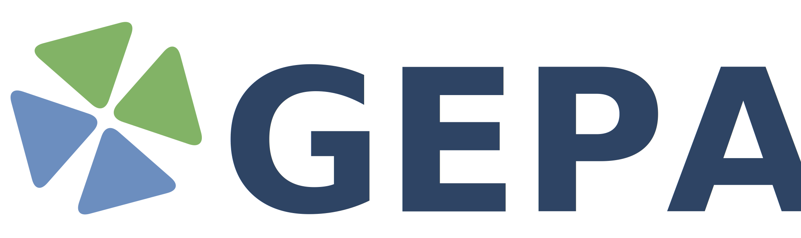

<div class="hero-section">
  <div style="text-align: center; margin-bottom: 1rem; padding-top: 1.5rem; margin-right: 2rem;">
    
    
  </div>
  <p class="hero-subtitle">Automatically optimize prompts for any AI system</p>
  <p class="hero-stats-line">
    <strong><a href="https://www.databricks.com/blog/building-state-art-enterprise-agents-90x-cheaper-automated-prompt-optimization" target="_blank" class="hero-link">Frontier Performance</a></strong>, up to 90x cheaper&ensp;|&ensp;<strong><a href="https://arxiv.org/abs/2507.19457" target="_blank" class="hero-link">35x faster</a></strong> than RL
  </p>
  <p class="hero-used-by">
    Used by <a href="https://x.com/tobi/status/1963434604741701909" target="_blank" class="hero-link">Shopify</a>, <a href="https://www.databricks.com/blog/building-state-art-enterprise-agents-90x-cheaper-automated-prompt-optimization" target="_blank" class="hero-link">Databricks</a> and <a href="https://x.com/drewhouston/status/1974750621690728623" target="_blank" class="hero-link">Dropbox</a>
  </p>
  <div class="cta-buttons">
    <a href="guides/quickstart/" class="cta-primary">
      <span class="twemoji"><svg xmlns="http://www.w3.org/2000/svg" viewBox="0 0 24 24"><path d="M11 15H6l7-14v8h5l-7 14v-8z"/></svg></span>
      Quickstart
    </a>
    <a href="https://github.com/gepa-ai/gepa" target="_blank" class="cta-secondary">
      <span class="twemoji"><svg xmlns="http://www.w3.org/2000/svg" viewBox="0 0 24 24"><path d="M12 .3a12 12 0 0 0-3.8 23.4c.6.1.8-.3.8-.6v-2c-3.3.7-4-1.6-4-1.6-.6-1.4-1.4-1.8-1.4-1.8-1-.7.1-.7.1-.7 1.2 0 1.9 1.2 1.9 1.2 1 1.8 2.8 1.3 3.5 1 .1-.8.4-1.3.7-1.6-2.7-.3-5.5-1.3-5.5-6 0-1.2.5-2.3 1.3-3.1-.2-.4-.6-1.6 0-3.2 0 0 1-.3 3.4 1.2a11.5 11.5 0 0 1 6 0c2.3-1.5 3.3-1.2 3.3-1.2.6 1.6.2 2.8 0 3.2.9.8 1.3 1.9 1.3 3.2 0 4.6-2.8 5.6-5.5 5.9.5.4.9 1 .9 2.2v3.3c0 .3.1.7.8.6A12 12 0 0 0 12 .3"/></svg></span>
      GitHub
    </a>
    <a href="https://arxiv.org/abs/2507.19457" target="_blank" class="cta-secondary">
      <span class="twemoji"><svg xmlns="http://www.w3.org/2000/svg" viewBox="0 0 24 24"><path d="M9 3v15h3V3H9zm3 2 4 13 3-1-4-13-3 1zM5 5v13h3V5H5z"/></svg></span>
      Paper
    </a>
  </div>
  <div class="hero-badges">
    <a href="https://pypistats.org/packages/gepa" target="_blank"></a>
  </div>
</div>

<!-- Company Logos Marquee -->
<div class="marquee-section">
  <div class="marquee-label">Trusted by<br>teams at</div>
  <div class="marquee-wrapper">
    <div class="marquee-track">
      <a href="https://x.com/tobi/status/1963434604741701909" target="_blank">Shopify</a>
      <a href="https://developers.openai.com/cookbook/examples/partners/self_evolving_agents/autonomous_agent_retraining" target="_blank">OpenAI</a>
      <a href="https://www.databricks.com/blog/building-state-art-enterprise-agents-90x-cheaper-automated-prompt-optimization" target="_blank">Databricks</a>
      <a href="https://pydantic.dev/articles/prompt-optimization-with-gepa" target="_blank">Pydantic</a>
      <a href="https://dropbox.tech/machine-learning/vp-josh-clemm-knowledge-graphs-mcp-and-dspy-dash" target="_blank">Dropbox</a>
      <a href="https://www.comet.com/site/blog/opik-product-releases-october2025/" target="_blank">Comet ML</a>
      <a href="https://github.com/weaviate/recipes/blob/main/integrations/llm-agent-frameworks/dspy/GEPA-Hands-On-Reranker.ipynb" target="_blank">Weaviate</a>
      <a href="https://mlflow.org/blog/mlflow-prompt-optimization" target="_blank">MLFlow</a>
      <span>Uber</span>
      <span>Meta</span>
      <span>AWS</span>
      <span>Cerebras</span>
      <a href="https://x.com/risk_seeking/status/2015853790512222602?s=20" target="_blank">Standard Metrics</a>
      <a href="https://x.com/swyx/status/1991598247782281371?s=20" target="_blank">The Browser Company</a>
      <a href="https://www.linkedin.com/posts/dria-ai_today-were-releasing-something-weve-used-activity-7396920472237477888-WyXN" target="_blank">Dria</a>
      <a href="https://github.com/PrimeIntellect-ai/verifiers/tree/main/verifiers/gepa" target="_blank">Prime Intellect</a>
      <span>NuBank</span>
      <span>Infosys</span>
      <span>Invitae</span>
      <span>Bespoke Labs</span>
      <!-- duplicate set for seamless loop -->
      <a href="https://x.com/tobi/status/1963434604741701909" target="_blank">Shopify</a>
      <a href="https://developers.openai.com/cookbook/examples/partners/self_evolving_agents/autonomous_agent_retraining" target="_blank">OpenAI</a>
      <a href="https://www.databricks.com/blog/building-state-art-enterprise-agents-90x-cheaper-automated-prompt-optimization" target="_blank">Databricks</a>
      <a href="https://pydantic.dev/articles/prompt-optimization-with-gepa" target="_blank">Pydantic</a>
      <a href="https://dropbox.tech/machine-learning/vp-josh-clemm-knowledge-graphs-mcp-and-dspy-dash" target="_blank">Dropbox</a>
      <a href="https://www.comet.com/site/blog/opik-product-releases-october2025/" target="_blank">Comet ML</a>
      <a href="https://github.com/weaviate/recipes/blob/main/integrations/llm-agent-frameworks/dspy/GEPA-Hands-On-Reranker.ipynb" target="_blank">Weaviate</a>
      <a href="https://mlflow.org/blog/mlflow-prompt-optimization" target="_blank">MLFlow</a>
      <span>Uber</span>
      <span>Meta</span>
      <span>AWS</span>
      <span>Cerebras</span>
      <a href="https://x.com/risk_seeking/status/2015853790512222602?s=20" target="_blank">Standard Metrics</a>
      <a href="https://x.com/swyx/status/1991598247782281371?s=20" target="_blank">The Browser Company</a>
      <a href="https://www.linkedin.com/posts/dria-ai_today-were-releasing-something-weve-used-activity-7396920472237477888-WyXN" target="_blank">Dria</a>
      <a href="https://github.com/PrimeIntellect-ai/verifiers/tree/main/verifiers/gepa" target="_blank">Prime Intellect</a>
      <span>NuBank</span>
      <span>Infosys</span>
      <a href="https://sutro.sh/" target="_blank">Sutro</a>
      <span>Invitae</span>
      <span>Bespoke Labs</span>
    </div>
  </div>
</div>

## :material-format-quote-close: What People Are Saying

<div class="testimonials-grid">
  <div class="testimonial-card">
    <div class="testimonial-header">
      <div class="testimonial-icon">
        
      </div>
      <div>
        <div class="testimonial-author">Tobi Lutke</div>
        <div class="testimonial-role">CEO, Shopify</div>
      </div>
    </div>
    <div class="testimonial-content">Both DSPy and (especially) <strong>GEPA are currently severely under hyped</strong> in the AI context engineering world</div>
    <a href="https://x.com/tobi/status/1963434604741701909" class="testimonial-link" target="_blank">
      <span class="twemoji"><svg xmlns="http://www.w3.org/2000/svg" viewBox="0 0 24 24"><path d="M18.244 2.25h3.308l-7.227 8.26 8.502 11.24H16.17l-5.214-6.817L4.99 21.75H1.68l7.73-8.835L1.254 2.25H8.08l4.713 6.231zm-1.161 17.52h1.833L7.084 4.126H5.117z"/></svg></span>
      View on X
    </a>
  </div>
  <div class="testimonial-card">
    <div class="testimonial-header">
      <div class="testimonial-icon">
        
      </div>
      <div>
        <div class="testimonial-author">Ivan Zhou</div>
        <div class="testimonial-role">Research Engineer, Databricks Mosaic</div>
      </div>
    </div>
    <div class="testimonial-content">GEPA can <strong>push open models beyond frontier performance;</strong> gpt-oss-120b + GEPA beats Claude Opus 4.1 while being <strong>90x cheaper</strong></div>
    <a href="https://x.com/ivanhzyy/status/1971066193747689521" class="testimonial-link" target="_blank">
      <span class="twemoji"><svg xmlns="http://www.w3.org/2000/svg" viewBox="0 0 24 24"><path d="M18.244 2.25h3.308l-7.227 8.26 8.502 11.24H16.17l-5.214-6.817L4.99 21.75H1.68l7.73-8.835L1.254 2.25H8.08l4.713 6.231zm-1.161 17.52h1.833L7.084 4.126H5.117z"/></svg></span>
      View on X
    </a>
  </div>
  <div class="testimonial-card">
    <div class="testimonial-header">
      <div class="testimonial-icon">
        
      </div>
      <div>
        <div class="testimonial-author">Drew Houston</div>
        <div class="testimonial-role">CEO, Dropbox</div>
      </div>
    </div>
    <div class="testimonial-content">Have heard great things about DSPy plus GEPA, which is an <strong>even stronger prompt optimizer than miprov2</strong> &mdash; repo and (fascinating) examples of generated prompts</div>
    <a href="https://x.com/drewhouston/status/1974750621690728623" class="testimonial-link" target="_blank">
      <span class="twemoji"><svg xmlns="http://www.w3.org/2000/svg" viewBox="0 0 24 24"><path d="M18.244 2.25h3.308l-7.227 8.26 8.502 11.24H16.17l-5.214-6.817L4.99 21.75H1.68l7.73-8.835L1.254 2.25H8.08l4.713 6.231zm-1.161 17.52h1.833L7.084 4.126H5.117z"/></svg></span>
      View on X
    </a>
  </div>
</div>

<script>
document.addEventListener('DOMContentLoaded', function() {
  const allTestimonials = [
    {
      icon: '',
      author: 'Tobi Lutke',
      role: 'CEO, Shopify',
      content: 'Both DSPy and (especially) <strong>GEPA are currently severely under hyped</strong> in the AI context engineering world',
      linkUrl: 'https://x.com/tobi/status/1963434604741701909',
      linkIcon: '<svg xmlns="http://www.w3.org/2000/svg" viewBox="0 0 24 24"><path d="M18.244 2.25h3.308l-7.227 8.26 8.502 11.24H16.17l-5.214-6.817L4.99 21.75H1.68l7.73-8.835L1.254 2.25H8.08l4.713 6.231zm-1.161 17.52h1.833L7.084 4.126H5.117z"/></svg>',
      linkText: 'View on X'
    },
    {
      icon: '',
      author: 'Ivan Zhou',
      role: 'Research Engineer, Databricks Mosaic',
      content: 'GEPA can <strong>push open models beyond frontier performance;</strong> gpt-oss-120b + GEPA beats Claude Opus 4.1 while being <strong>90x cheaper</strong>',
      linkUrl: 'https://x.com/ivanhzyy/status/1971066193747689521',
      linkIcon: '<svg xmlns="http://www.w3.org/2000/svg" viewBox="0 0 24 24"><path d="M18.244 2.25h3.308l-7.227 8.26 8.502 11.24H16.17l-5.214-6.817L4.99 21.75H1.68l7.73-8.835L1.254 2.25H8.08l4.713 6.231zm-1.161 17.52h1.833L7.084 4.126H5.117z"/></svg>',
      linkText: 'View on X'
    },
    {
      icon: '',
      author: 'Drew Houston',
      role: 'CEO, Dropbox',
      content: 'Have heard great things about DSPy plus GEPA, which is an <strong>even stronger prompt optimizer than miprov2</strong> &mdash; repo and (fascinating) examples of generated prompts',
      linkUrl: 'https://x.com/drewhouston/status/1974750621690728623',
      linkIcon: '<svg xmlns="http://www.w3.org/2000/svg" viewBox="0 0 24 24"><path d="M18.244 2.25h3.308l-7.227 8.26 8.502 11.24H16.17l-5.214-6.817L4.99 21.75H1.68l7.73-8.835L1.254 2.25H8.08l4.713 6.231zm-1.161 17.52h1.833L7.084 4.126H5.117z"/></svg>',
      linkText: 'View on X'
    },
    {
      icon: '<svg xmlns="http://www.w3.org/2000/svg" viewBox="0 0 24 24"><path d="M18 6h-2c0-2.21-1.79-4-4-4S8 3.79 8 6H6c-1.1 0-2 .9-2 2v10c0 1.1.9 2 2 2h12c1.1 0 2-.9 2-2V8c0-1.1-.9-2-2-2zm-6-2c1.1 0 2 .9 2 2h-4c0-1.1.9-2 2-2zm6 14H6V8h2v2c0 .55.45 1 1 1s1-.45 1-1V8h4v2c0 .55.45 1 1 1s1-.45 1-1V8h2v10z"/></svg>',
      author: 'Chad Boyda',
      role: 'CTO, AppSumo',
      content: 'DSPy\'s GEPA is prompt engineering! <strong>The only kind we should all collectively be doing.</strong> What a work of art',
      linkUrl: 'https://x.com/chadboyda/status/1955298177197764963',
      linkIcon: '<svg xmlns="http://www.w3.org/2000/svg" viewBox="0 0 24 24"><path d="M18.244 2.25h3.308l-7.227 8.26 8.502 11.24H16.17l-5.214-6.817L4.99 21.75H1.68l7.73-8.835L1.254 2.25H8.08l4.713 6.231zm-1.161 17.52h1.833L7.084 4.126H5.117z"/></svg>',
      linkText: 'View on X'
    },
    {
      icon: '<svg xmlns="http://www.w3.org/2000/svg" viewBox="0 0 24 24"><path d="M22.2819 9.8211a5.9847 5.9847 0 0 0-.5157-4.9108 6.0462 6.0462 0 0 0-6.5098-2.9A6.0651 6.0651 0 0 0 4.9807 4.1818a5.9847 5.9847 0 0 0-3.9977 2.9 6.0462 6.0462 0 0 0 .7427 7.0966 5.98 5.98 0 0 0 .511 4.9107 6.051 6.051 0 0 0 6.5146 2.9001A5.9847 5.9847 0 0 0 13.2599 24a6.0557 6.0557 0 0 0 5.7718-4.2058 5.9894 5.9894 0 0 0 3.9977-2.9001 6.0557 6.0557 0 0 0-.7475-7.0729zm-9.022 12.6081a4.4755 4.4755 0 0 1-2.8764-1.0408l.1419-.0804 4.7783-2.7582a.7948.7948 0 0 0 .3927-.6813v-6.7369l2.02 1.1686a.071.071 0 0 1 .038.052v5.5826a4.504 4.504 0 0 1-4.4945 4.4944zm-9.6607-4.1254a4.4708 4.4708 0 0 1-.5346-3.0137l.142.0852 4.783 2.7582a.7712.7712 0 0 0 .7806 0l5.8428-3.3685v2.3324a.0804.0804 0 0 1-.0332.0615L9.74 19.9502a4.4992 4.4992 0 0 1-6.1408-1.6464zM2.3408 7.8956a4.485 4.485 0 0 1 2.3655-1.9728V11.6a.7664.7664 0 0 0 .3879.6765l5.8144 3.3543-2.0201 1.1685a.0757.0757 0 0 1-.071 0l-4.8303-2.7865A4.504 4.504 0 0 1 2.3408 7.872zm16.5963 3.8558L13.1038 8.364l2.0201-1.1638a.0757.0757 0 0 1 .071 0l4.8303 2.7913a4.4944 4.4944 0 0 1-.6765 8.1042v-5.6772a.79.79 0 0 0-.4092-.6813zm2.0107-3.0231l-.142-.0852-4.7735-2.7818a.7759.7759 0 0 0-.7854 0L9.409 9.2297V6.8974a.0662.0662 0 0 1 .0284-.0615l4.8303-2.7866a4.4992 4.4992 0 0 1 6.6802 4.66zM8.3065 12.863l-2.02-1.1638a.0804.0804 0 0 1-.038-.0567V6.0742a4.4992 4.4992 0 0 1 7.3757-3.4537l-.142.0805L8.704 5.459a.7948.7948 0 0 0-.3927.6813zm1.0976-2.3654l2.602-1.4998 2.6069 1.4998v2.9994l-2.5974 1.4997-2.6067-1.4997z"/></svg>',
      author: 'OpenAI',
      role: 'Official Cookbook',
      content: 'Self-evolving agents that autonomously retrain themselves using GEPA to improve performance over time.',
      linkUrl: 'https://developers.openai.com/cookbook/examples/partners/self_evolving_agents/autonomous_agent_retraining',
      linkIcon: '<svg xmlns="http://www.w3.org/2000/svg" viewBox="0 0 24 24"><path d="M14 3v2H4v14h14v-8h2v10H2V3z"/><path d="M19 2h-7l2.29 2.29-2.88 2.88 1.42 1.42 2.88-2.88L18 8V2z"/></svg>',
      linkText: 'Read Cookbook'
    },
    {
      icon: '',
      author: 'Josh Clemm',
      role: 'VP of Engineering, Dropbox Dash',
      content: 'With DSPy [GEPA], <strong>you just plug the model in, define your goals, and out spits the prompt that works</strong>. So you can do this model switching far more rapidly.',
      linkUrl: 'https://dropbox.tech/machine-learning/vp-josh-clemm-knowledge-graphs-mcp-and-dspy-dash',
      linkIcon: '<svg xmlns="http://www.w3.org/2000/svg" viewBox="0 0 24 24"><path d="M14 3v2H4v14h14v-8h2v10H2V3z"/><path d="M19 2h-7l2.29 2.29-2.88 2.88 1.42 1.42 2.88-2.88L18 8V2z"/></svg>',
      linkText: 'Read More'
    }
  ];

  function renderCard(t) {
    return `<div class="testimonial-header">
      <div class="testimonial-icon">${t.icon}</div>
      <div>
        <div class="testimonial-author">${t.author}</div>
        <div class="testimonial-role">${t.role}</div>
      </div>
    </div>
    <div class="testimonial-content">${t.content}</div>
    <a href="${t.linkUrl}" class="testimonial-link" target="_blank">
      <span class="twemoji">${t.linkIcon}</span>
      ${t.linkText}
    </a>`;
  }

  const grid = document.querySelector('.testimonials-grid');
  if (!grid) return;
  const cards = grid.querySelectorAll('.testimonial-card');

  // Track which testimonials are currently visible (indices into allTestimonials)
  let visible = [0, 1, 2];
  // Queue of testimonials waiting to be shown
  let queue = [3, 4, 5];
  let swapInterval;

  function swapOne() {
    if (queue.length === 0) {
      // Rebuild queue from all non-visible testimonials
      queue = [];
      for (let i = 0; i < allTestimonials.length; i++) {
        if (!visible.includes(i)) queue.push(i);
      }
      // Shuffle the queue
      for (let i = queue.length - 1; i > 0; i--) {
        const j = Math.floor(Math.random() * (i + 1));
        [queue[i], queue[j]] = [queue[j], queue[i]];
      }
    }

    // Pick a random slot (0, 1, or 2) to replace
    const slotIndex = Math.floor(Math.random() * 3);
    const card = cards[slotIndex];
    const nextTestimonialIndex = queue.shift();

    // Animate out
    card.classList.add('testimonial-swap-out');

    setTimeout(() => {
      // Swap content
      card.innerHTML = renderCard(allTestimonials[nextTestimonialIndex]);
      visible[slotIndex] = nextTestimonialIndex;

      // Animate in
      card.classList.remove('testimonial-swap-out');
      card.classList.add('testimonial-swap-in');

      setTimeout(() => {
        card.classList.remove('testimonial-swap-in');
      }, 500);
    }, 500);
  }

  function startSwapping() {
    clearInterval(swapInterval);
    swapInterval = setInterval(swapOne, 3500);
  }

  function stopSwapping() {
    clearInterval(swapInterval);
  }

  grid.addEventListener('mouseenter', stopSwapping);
  grid.addEventListener('mouseleave', startSwapping);

  startSwapping();
});
</script>

## :material-rocket-launch-outline: Get Started

<div class="badges-row">
  <a href="https://pypi.org/project/gepa/" target="_blank"></a>
  <a href="https://github.com/gepa-ai/gepa" target="_blank"></a>
  <a href="https://arxiv.org/abs/2507.19457" target="_blank"></a>
  <a href="https://opensource.org/licenses/MIT" target="_blank"></a>
</div>

```bash
pip install gepa
```

=== "Basic Example"

    ```python
    import gepa

    # Load your dataset
    trainset, valset, _ = gepa.examples.aime.init_dataset()

    # Define your initial prompt
    seed_prompt = {"system_prompt": "You are a helpful assistant..."}

    # Run optimization
    result = gepa.optimize(
        seed_candidate=seed_prompt,
        trainset=trainset,
        valset=valset,
        task_lm="openai/gpt-4.1-mini",
        max_metric_calls=150,
        reflection_lm="openai/gpt-5",
    )

    print(result.best_candidate['system_prompt'])
    ```

    **Result:** +10% improvement (46.6% &rarr; 56.6%) on AIME 2025 with GPT-4.1 Mini

=== "With DSPy"

    ```python
    import dspy

    class RAG(dspy.Module):
        def __init__(self):
            self.retrieve = dspy.Retrieve(k=3)
            self.generate = dspy.ChainOfThought("context, question -> answer")

        def forward(self, question):
            context = self.retrieve(question).passages
            return self.generate(context=context, question=question)

    # Optimize with GEPA
    gepa = dspy.GEPA(
        metric=your_metric,
        max_metric_calls=150,
        reflection_lm="openai/gpt-5"
    )
    optimized_rag = gepa.compile(student=RAG(), trainset=trainset, valset=valset)
    ```

    GEPA is built into DSPy! See [DSPy tutorials](https://dspy.ai/tutorials/gepa_ai_program/) for more.

=== "Custom System"

    ```python
    from gepa import optimize
    from gepa.core.adapter import EvaluationBatch

    class MySystemAdapter:
        def evaluate(self, batch, candidate, capture_traces=False):
            outputs, scores, trajectories = [], [], []
            for example in batch:
                prompt = candidate['my_prompt']
                result = my_system.run(prompt, example)
                score = compute_score(result, example)
                outputs.append(result)
                scores.append(score)
                if capture_traces:
                    trajectories.append({
                        'input': example,
                        'output': result.output,
                        'steps': result.intermediate_steps,
                        'errors': result.errors
                    })
            return EvaluationBatch(
                outputs=outputs,
                scores=scores,
                trajectories=trajectories if capture_traces else None
            )

        def make_reflective_dataset(self, candidate, eval_batch, components_to_update):
            reflective_data = {}
            for component in components_to_update:
                reflective_data[component] = []
                for traj, score in zip(eval_batch.trajectories, eval_batch.scores):
                    reflective_data[component].append({
                        'Inputs': traj['input'],
                        'Generated Outputs': traj['output'],
                        'Feedback': f"Score: {score}. Errors: {traj['errors']}"
                    })
            return reflective_data

    result = optimize(
        seed_candidate={'my_prompt': 'Initial prompt...'},
        trainset=my_trainset,
        valset=my_valset,
        adapter=MySystemAdapter(),
        task_lm="openai/gpt-4.1-mini",
    )
    ```

## :material-chart-line: Results

<div class="stats-grid">
  <a href="https://www.databricks.com/blog/building-state-art-enterprise-agents-90x-cheaper-automated-prompt-optimization" target="_blank" class="stat-card">
    <span class="stat-number">90x</span>
    <span class="stat-label">Cost Reduction</span>
    <span class="stat-desc">Open-source models beat Claude Opus 4.1 at Databricks</span>
  </a>
  <a href="blog/introducing-optimize-anything/#6-agent-architecture-discovery-arc-agi" class="stat-card">
    <span class="stat-number">32→89</span>
    <span class="stat-label">Gains on ARC-AGI</span>
    <span class="stat-desc">Agent architecture evolved from 10 lines to 300+</span>
  </a>
  <a href="blog/introducing-optimize-anything/#4-ai-driven-systems-research-cloudcast-cant-be-late" class="stat-card">
    <span class="stat-number">40.2%</span>
    <span class="stat-label">Cost Savings</span>
    <span class="stat-desc">Cloud scheduling policy discovered by GEPA</span>
  </a>
  <a href="guides/use-cases/" class="stat-card">
    <span class="stat-number">50+</span>
    <span class="stat-label">Production Use Cases</span>
    <span class="stat-desc">Across diverse industries</span>
  </a>
</div>

## :material-cog: How It Works

Traditional optimizers (RL, evolutionary strategies) collapse rich execution traces into a single scalar reward — they know *that* a candidate failed, but not *why*. GEPA takes a different approach: evaluators return **Actionable Side Information (ASI)** — error messages, profiling data, reasoning logs — and an LLM reads this feedback to diagnose failures and propose targeted fixes. Each mutation inherits accumulated lessons from all ancestors in the search tree. GEPA also supports <em>system-aware merge</em> — combining strengths of two pareto-optimal candidates excelling on different tasks.

<div class="how-it-works-flow">
  <div class="flow-step">
    <div class="flow-step-num">1</div>
    <div class="flow-step-icon" style="color: #212C4D;"><svg xmlns="http://www.w3.org/2000/svg" viewBox="0 0 24 24" width="24" height="24"><path fill="currentColor" d="M3 13h2v-2H3v2zm0 4h2v-2H3v2zm0-8h2V7H3v2zm4 4h14v-2H7v2zm0 4h14v-2H7v2zM7 7v2h14V7H7z"/></svg></div>
    <div class="flow-step-label">Select from<br>Pareto Front</div>
    <div class="flow-step-desc">Pick candidate excelling on <em>some</em> examples</div>
  </div>
  <div class="flow-arrow">&rarr;</div>
  <div class="flow-step">
    <div class="flow-step-num">2</div>
    <div class="flow-step-icon" style="color: #3b82f6;"><svg xmlns="http://www.w3.org/2000/svg" viewBox="0 0 24 24" width="24" height="24"><path fill="currentColor" d="M19 3H5c-1.1 0-2 .9-2 2v14c0 1.1.9 2 2 2h14c1.1 0 2-.9 2-2V5c0-1.1-.9-2-2-2zm-5 14H7v-2h7v2zm3-4H7v-2h10v2zm0-4H7V7h10v2z"/></svg></div>
    <div class="flow-step-label">Run on<br>Minibatch</div>
    <div class="flow-step-desc">Execute &amp; capture full traces</div>
  </div>
  <div class="flow-arrow">&rarr;</div>
  <div class="flow-step">
    <div class="flow-step-num">3</div>
    <div class="flow-step-icon" style="color: #22c55e;"><svg xmlns="http://www.w3.org/2000/svg" viewBox="0 0 24 24" width="24" height="24"><path fill="currentColor" d="M9.4 16.6L4.8 12l4.6-4.6L8 6l-6 6 6 6 1.4-1.4zm5.2 0l4.6-4.6-4.6-4.6L16 6l6 6-6 6-1.4-1.4z"/></svg></div>
    <div class="flow-step-label">Reflect with<br>LLM</div>
    <div class="flow-step-desc">Diagnose failures in natural language</div>
  </div>
  <div class="flow-arrow">&rarr;</div>
  <div class="flow-step">
    <div class="flow-step-num">4</div>
    <div class="flow-step-icon" style="color: #f97316;"><svg xmlns="http://www.w3.org/2000/svg" viewBox="0 0 24 24" width="24" height="24"><path fill="currentColor" d="M3 17.25V21h3.75L17.81 9.94l-3.75-3.75L3 17.25zM20.71 7.04c.39-.39.39-1.02 0-1.41l-2.34-2.34c-.39-.39-1.02-.39-1.41 0l-1.83 1.83 3.75 3.75 1.83-1.83z"/></svg></div>
    <div class="flow-step-label">Mutate<br>Prompt</div>
    <div class="flow-step-desc">Accumulate lessons from ancestors and new rollouts</div>
  </div>
  <div class="flow-arrow">&rarr;</div>
  <div class="flow-step">
    <div class="flow-step-num">5</div>
    <div class="flow-step-icon" style="color: #ec4899;"><svg xmlns="http://www.w3.org/2000/svg" viewBox="0 0 24 24" width="24" height="24"><path fill="currentColor" d="M9 16.17L4.83 12l-1.42 1.41L9 19 21 7l-1.41-1.41z"/></svg></div>
    <div class="flow-step-label">Accept if<br>Improved</div>
    <div class="flow-step-desc">Add to pool &amp; update Pareto front</div>
  </div>
  <div class="flow-loop">
    <svg xmlns="http://www.w3.org/2000/svg" viewBox="0 0 24 24" width="14" height="14"><path fill="currentColor" d="M12 4V1L8 5l4 4V6c3.31 0 6 2.69 6 6 0 1.01-.25 1.97-.7 2.8l1.46 1.46C19.54 15.03 20 13.57 20 12c0-4.42-3.58-8-8-8zm0 14c-3.31 0-6-2.69-6-6 0-1.01.25-1.97.7-2.8L5.24 7.74C4.46 8.97 4 10.43 4 12c0 4.42 3.58 8 8 8v3l4-4-4-4v3z"/></svg>
    Repeat until convergence
  </div>
</div>

<div class="how-it-works-insight">
  <span class="insight-links">Based on research from UC Berkeley, Stanford, MIT & Databricks. <a href="guides/">Learn how it works &rarr;</a> | <a href="https://arxiv.org/abs/2507.19457" target="_blank">Read the paper &rarr;</a></span>
</div>

## :material-application: GEPA Case Studies

<div class="use-cases-grid">
  <a href="guides/use-cases/#enterprise-production" class="use-case-card">
    <div class="use-case-icon"><svg xmlns="http://www.w3.org/2000/svg" viewBox="0 0 24 24"><path d="M12 7V3H2v18h20V7H12zM6 19H4v-2h2v2zm0-4H4v-2h2v2zm0-4H4V9h2v2zm0-4H4V5h2v2zm4 12H8v-2h2v2zm0-4H8v-2h2v2zm0-4H8V9h2v2zm0-4H8V5h2v2zm10 12h-8v-2h2v-2h-2v-2h2v-2h-2V9h8v10zm-2-8h-2v2h2v-2zm0 4h-2v2h2v-2z"/></svg></div>
    <div class="use-case-title">Enterprise & Production</div>
    <ul class="use-case-list">
      <li><strong>90x cost reduction</strong> at Databricks</li>
      <li>Self-evolving agents in OpenAI Cookbook</li>
      <li>Core algorithm in Comet ML Opik</li>
    </ul>
  </a>
  <a href="guides/use-cases/#ai-coding-agents-research-tools" class="use-case-card">
    <div class="use-case-icon"><svg xmlns="http://www.w3.org/2000/svg" viewBox="0 0 24 24"><path d="M9.4 16.6 4.8 12l4.6-4.6L8 6l-6 6 6 6 1.4-1.4zm5.2 0 4.6-4.6-4.6-4.6L16 6l6 6-6 6-1.4-1.4z"/></svg></div>
    <div class="use-case-title">AI Coding Agents</div>
    <ul class="use-case-list">
      <li>Production incident diagnosis</li>
      <li>Data analysis agents (FireBird)</li>
      <li>Code safety monitoring</li>
    </ul>
  </a>
  <a href="guides/use-cases/#domain-specific-applications" class="use-case-card">
    <div class="use-case-icon"><svg xmlns="http://www.w3.org/2000/svg" viewBox="0 0 24 24"><path d="M19 3H5c-1.1 0-2 .9-2 2v14c0 1.1.9 2 2 2h14c1.1 0 2-.9 2-2V5c0-1.1-.9-2-2-2zm-7 3c1.93 0 3.5 1.57 3.5 3.5S13.93 13 12 13s-3.5-1.57-3.5-3.5S10.07 6 12 6zm7 13H5v-.23c0-.62.28-1.2.76-1.58C7.47 15.82 9.64 15 12 15s4.53.82 6.24 2.19c.48.38.76.97.76 1.58V19z"/></svg></div>
    <div class="use-case-title">Domain-Specific</div>
    <ul class="use-case-list">
      <li>Healthcare multi-agent RAG systems</li>
      <li><strong>38% OCR error reduction</strong></li>
      <li>Market research AI personas</li>
    </ul>
  </a>
  <a href="guides/use-cases/#advanced-capabilities" class="use-case-card">
    <div class="use-case-icon"><svg xmlns="http://www.w3.org/2000/svg" viewBox="0 0 24 24"><path d="M13 3c-4.97 0-9 4.03-9 9H1l3.89 3.89.07.14L9 12H6c0-3.87 3.13-7 7-7s7 3.13 7 7-3.13 7-7 7c-1.93 0-3.68-.79-4.94-2.06l-1.42 1.42C8.27 19.99 10.51 21 13 21c4.97 0 9-4.03 9-9s-4.03-9-9-9zm-1 5v5l4.28 2.54.72-1.21-3.5-2.08V8H12z"/></svg></div>
    <div class="use-case-title">Research & Advanced</div>
    <ul class="use-case-list">
      <li>Multi-objective optimization</li>
      <li>Agent architecture discovery</li>
      <li>Adversarial prompt search</li>
    </ul>
  </a>
</div>

<div style="text-align: center; margin-top: 0.5rem;">
  <a href="guides/use-cases/" class="cta-secondary" style="font-size: 0.95rem;">View all 50+ use cases &rarr;</a>
</div>

## :material-target: GEPA Shines When

<div class="use-cases-grid">
  <div class="use-case-card">
    <div class="use-case-icon"><svg xmlns="http://www.w3.org/2000/svg" viewBox="0 0 24 24"><path d="M13 3c-4.97 0-9 4.03-9 9H1l3.89 3.89.07.14L9 12H6c0-3.87 3.13-7 7-7s7 3.13 7 7-3.13 7-7 7c-1.93 0-3.68-.79-4.94-2.06l-1.42 1.42C8.27 19.99 10.51 21 13 21c4.97 0 9-4.03 9-9s-4.03-9-9-9zm-1 5v5l4.28 2.54.72-1.21-3.5-2.08V8H12z"/></svg></div>
    <div class="use-case-title">Rollouts Are Expensive</div>
    <ul class="use-case-list">
      <li>Scientific simulations, slow compilation</li>
      <li>Complex agents with long tool calls</li>
      <li>100&ndash;500 evals vs. 10K+ for RL</li>
    </ul>
  </div>
  <div class="use-case-card">
    <div class="use-case-icon"><svg xmlns="http://www.w3.org/2000/svg" viewBox="0 0 24 24"><path d="M20 6h-8l-2-2H4c-1.1 0-2 .9-2 2v12c0 1.1.9 2 2 2h16c1.1 0 2-.9 2-2V8c0-1.1-.9-2-2-2zm-6 10H6v-2h8v2zm4-4H6v-2h12v2z"/></svg></div>
    <div class="use-case-title">Data Is Scarce</div>
    <ul class="use-case-list">
      <li>New hardware with zero training data</li>
      <li>Works with as few as 3 examples</li>
      <li>Rapid prototyping on novel domains</li>
    </ul>
  </div>
  <div class="use-case-card">
    <div class="use-case-icon"><svg xmlns="http://www.w3.org/2000/svg" viewBox="0 0 24 24"><path d="M12 1L3 5v6c0 5.55 3.84 10.74 9 12 5.16-1.26 9-6.45 9-12V5l-9-4zm0 10.99h7c-.53 4.12-3.28 7.79-7 8.94V12H5V6.3l7-3.11v8.8z"/></svg></div>
    <div class="use-case-title">API-Only Models</div>
    <ul class="use-case-list">
      <li>No weights access needed</li>
      <li>Optimize GPT-5, Claude, Gemini directly</li>
      <li>No custom infra or fine-tuning pipeline</li>
    </ul>
  </div>
  <div class="use-case-card">
    <div class="use-case-icon"><svg xmlns="http://www.w3.org/2000/svg" viewBox="0 0 24 24"><path d="M12 4.5C7 4.5 2.73 7.61 1 12c1.73 4.39 6 7.5 11 7.5s9.27-3.11 11-7.5c-1.73-4.39-6-7.5-11-7.5zM12 17c-2.76 0-5-2.24-5-5s2.24-5 5-5 5 2.24 5 5-2.24 5-5 5zm0-8c-1.66 0-3 1.34-3 3s1.34 3 3 3 3-1.34 3-3-1.34-3-3-3z"/></svg></div>
    <div class="use-case-title">You Need Interpretability</div>
    <ul class="use-case-list">
      <li>Human-readable optimization traces</li>
      <li>See <em>why</em> each prompt changed</li>
      <li>Debug complex agent behaviors</li>
    </ul>
  </div>
</div>

!!! note "GEPA complements RL and fine-tuning"
    These approaches are not mutually exclusive. Use GEPA for rapid initial optimization (minutes to hours, API-only access), then apply RL or fine-tuning for additional gains as demonstrated in [BetterTogether](https://arxiv.org/abs/2407.10930) / [mmGRPO](https://arxiv.org/abs/2508.04660) recipe. For scenarios with abundant data and 100,000+ cheap rollouts, gradient-based methods remain effective — GEPA works best when rollouts are expensive, data is scarce, or you need interpretable optimization traces.

## :material-account-group: Community & Resources

<div class="community-grid">
  <a href="guides/quickstart/" class="community-card">
    <div class="community-icon"><svg xmlns="http://www.w3.org/2000/svg" viewBox="0 0 24 24"><path d="M11 15H6l7-14v8h5l-7 14v-8z"/></svg></div>
    <div class="community-title">Quickstart</div>
    <div class="community-desc">Get up and running in minutes</div>
  </a>
  <a href="tutorials/" class="community-card">
    <div class="community-icon"><svg xmlns="http://www.w3.org/2000/svg" viewBox="0 0 24 24"><path d="M12 3L1 9l4 2.18v6L12 21l7-3.82v-6l2-1.09V17h2V9L12 3zm6.82 6L12 12.72 5.18 9 12 5.28 18.82 9zM17 15.99l-5 2.73-5-2.73v-3.72L12 15l5-2.73v3.72z"/></svg></div>
    <div class="community-title">Tutorials</div>
    <div class="community-desc">Step-by-step guides</div>
  </a>
  <a href="api/" class="community-card">
    <div class="community-icon"><svg xmlns="http://www.w3.org/2000/svg" viewBox="0 0 24 24"><path d="M7 5h10v2h2V3c0-1.1-.9-2-2-2H7c-1.1 0-2 .9-2 2v4h2V5zm8.41 11.59L20 12l-4.59-4.59L14 8.83 17.17 12 14 15.17l1.41 1.42zM10 15.17 6.83 12 10 8.83 8.59 7.41 4 12l4.59 4.59L10 15.17zM17 19H7v-2H5v4c0 1.1.9 2 2 2h10c1.1 0 2-.9 2-2v-4h-2v2z"/></svg></div>
    <div class="community-title">API Reference</div>
    <div class="community-desc">Full documentation</div>
  </a>
  <a href="https://discord.gg/WXFSeVGdbW" target="_blank" class="community-card">
    <div class="community-icon"><svg xmlns="http://www.w3.org/2000/svg" viewBox="0 0 24 24"><path d="M20.317 4.37a19.791 19.791 0 0 0-4.885-1.515.074.074 0 0 0-.079.037c-.21.375-.444.864-.608 1.25a18.27 18.27 0 0 0-5.487 0 12.64 12.64 0 0 0-.617-1.25.077.077 0 0 0-.079-.037A19.736 19.736 0 0 0 3.677 4.37a.07.07 0 0 0-.032.027C.533 9.046-.32 13.58.099 18.057a.082.082 0 0 0 .031.057 19.9 19.9 0 0 0 5.993 3.03.078.078 0 0 0 .084-.028 14.09 14.09 0 0 0 1.226-1.994.076.076 0 0 0-.041-.106 13.107 13.107 0 0 1-1.872-.892.077.077 0 0 1-.008-.128 10.2 10.2 0 0 0 .372-.292.074.074 0 0 1 .077-.01c3.928 1.793 8.18 1.793 12.062 0a.074.074 0 0 1 .078.01c.12.098.246.198.373.292a.077.077 0 0 1-.006.127 12.299 12.299 0 0 1-1.873.892.077.077 0 0 0-.041.107c.36.698.772 1.362 1.225 1.993a.076.076 0 0 0 .084.028 19.839 19.839 0 0 0 6.002-3.03.077.077 0 0 0 .032-.054c.5-5.177-.838-9.674-3.549-13.66a.061.061 0 0 0-.031-.03zM8.02 15.33c-1.183 0-2.157-1.085-2.157-2.419 0-1.333.956-2.419 2.157-2.419 1.21 0 2.176 1.096 2.157 2.42 0 1.333-.956 2.418-2.157 2.418zm7.975 0c-1.183 0-2.157-1.085-2.157-2.419 0-1.333.955-2.419 2.157-2.419 1.21 0 2.176 1.096 2.157 2.42 0 1.333-.946 2.418-2.157 2.418z"/></svg></div>
    <div class="community-title">Discord</div>
    <div class="community-desc">Join 1,000+ developers</div>
  </a>
  <a href="https://github.com/gepa-ai/gepa" target="_blank" class="community-card">
    <div class="community-icon"><svg xmlns="http://www.w3.org/2000/svg" viewBox="0 0 24 24"><path d="M12 .3a12 12 0 0 0-3.8 23.4c.6.1.8-.3.8-.6v-2c-3.3.7-4-1.6-4-1.6-.6-1.4-1.4-1.8-1.4-1.8-1-.7.1-.7.1-.7 1.2 0 1.9 1.2 1.9 1.2 1 1.8 2.8 1.3 3.5 1 .1-.8.4-1.3.7-1.6-2.7-.3-5.5-1.3-5.5-6 0-1.2.5-2.3 1.3-3.1-.2-.4-.6-1.6 0-3.2 0 0 1-.3 3.4 1.2a11.5 11.5 0 0 1 6 0c2.3-1.5 3.3-1.2 3.3-1.2.6 1.6.2 2.8 0 3.2.9.8 1.3 1.9 1.3 3.2 0 4.6-2.8 5.6-5.5 5.9.5.4.9 1 .9 2.2v3.3c0 .3.1.7.8.6A12 12 0 0 0 12 .3"/></svg></div>
    <div class="community-title">GitHub</div>
    <div class="community-desc">Star, contribute, report issues</div>
  </a>
  <a href="https://x.com/LakshyAAAgrawal" target="_blank" class="community-card">
    <div class="community-icon"><svg xmlns="http://www.w3.org/2000/svg" viewBox="0 0 24 24"><path d="M18.244 2.25h3.308l-7.227 8.26 8.502 11.24H16.17l-5.214-6.817L4.99 21.75H1.68l7.73-8.835L1.254 2.25H8.08l4.713 6.231zm-1.161 17.52h1.833L7.084 4.126H5.117z"/></svg></div>
    <div class="community-title">Twitter/X</div>
    <div class="community-desc">Updates and highlights</div>
  </a>
</div>

<div class="success-cta">
  <p>Built something with GEPA? We'd love to feature your work.</p>
  <div class="cta-buttons">
    <a href="mailto:lakshyaaagrawal@berkeley.edu?subject=GEPA%20Project%20Submission" class="cta-primary">Submit via Email</a>
    <a href="https://github.com/gepa-ai/gepa/issues/new?title=Project%20Submission&body=Organization:%0A%0AProject%20Description:%0A%0AResults:%0A%0ALink%20to%20paper/blog/code:" target="_blank" class="cta-secondary">Submit via GitHub</a>
  </div>
</div>

## :material-format-quote-close: Citation

If you use GEPA in your research, please cite our paper:

```bibtex
@misc{agrawal2025gepareflectivepromptevolution,
      title={GEPA: Reflective Prompt Evolution Can Outperform Reinforcement Learning},
      author={Lakshya A Agrawal and Shangyin Tan and Dilara Soylu and Noah Ziems and
              Rishi Khare and Krista Opsahl-Ong and Arnav Singhvi and Herumb Shandilya and
              Michael J Ryan and Meng Jiang and Christopher Potts and Koushik Sen and
              Alexandros G. Dimakis and Ion Stoica and Dan Klein and Matei Zaharia and Omar Khattab},
      year={2025},
      eprint={2507.19457},
      archivePrefix={arXiv},
      primaryClass={cs.CL},
      url={https://arxiv.org/abs/2507.19457}
}
```
